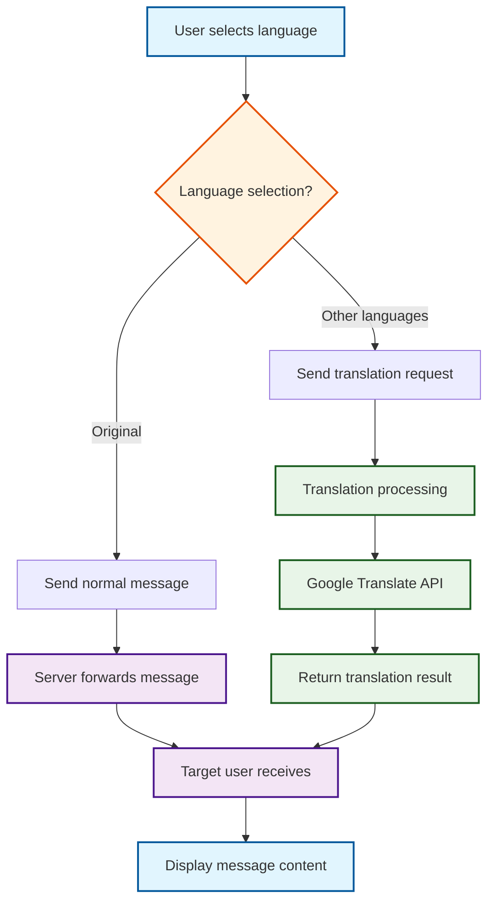

# Translation Functionality Flowchart

## 📋 Overview

This document provides a detailed description of the translation functionality workflow for the Internetkommunikation_Project_Gruppe4 chat application, including Mermaid flowcharts and text explanations.

## 🔄 Mermaid Flowchart

If you are viewing this on a platform that supports Mermaid (such as GitHub, GitLab, etc.), the following chart will render automatically:



## 📝 Text Flowchart

If the Mermaid chart cannot be displayed, please refer to the following text flowchart:

```
User selects language
    ↓
Language selection decision
    ├─ Original → Send normal message → Server forwards → Target user receives → Display message
    └─ Other languages → Send translation request → Translation processing → Google Translate API → Return translation result → Target user receives → Display translated message
```

## 🔧 Detailed Flow Description

### 1. User selects language
- **Location**: Language selection dropdown in client interface
- **Options**: Original, Deutsch, English, Chinese, Türkçe
- **Purpose**: Determines whether the message needs translation

### 2. Message processing branch
- **Original path**: 
  - Send normal message directly
  - No translation processing
  - Message format: `textContent`
  
- **Translation path**:
  - Send translation request
  - Include original text and target language
  - Message format: `translate`

### 3. Server processing
- **Receive message**: Server receives message sent by client
- **Determine type**: Choose processing method based on message content type
- **Translation processing**: Call Google Translate API for translation
- **Result generation**: Generate complete message containing original and translated text

### 4. Message forwarding
- **Target determination**: Determine target user based on message recipient information
- **Cross-server**: If target user is on another server, perform cross-server forwarding
- **Message sending**: Send processed message to target user

### 5. Client display
- **Message reception**: Target user client receives message
- **Content parsing**: Parse message content, determine display method
- **Interface update**: Display corresponding content in chat interface

## 🌐 Network Communication Flow

### Client to Server
```
Client → TCP connection → Server
Message format: purpose length payload\n
```

### Server-to-Server Communication
```
Server A → TCP connection → Server B
Forwarding format: Maintain original message format
```

### Server to Client
```
Server → TCP connection → Client
Response format: Complete message containing translation result
```

## 📊 Message Format Examples

### Normal Message
```protobuf
message ChatMessage {
    User sender = 1;
    User recipient = 2;
    string textContent = 3;  // Normal text content
    int64 timestamp = 4;
}
```

### Translation Message
```protobuf
message ChatMessage {
    User sender = 1;
    User recipient = 2;
    TranslateMessage translate = 3;  // Translation content
    int64 timestamp = 4;
}

message TranslateMessage {
    string original_text = 1;    // Original text
    string translated_text = 2;  // Translated text
    int32 target_language = 3;   // Target language
}
```

## 🔧 Technical Implementation Details

### Translation API Call
```python
def translator(text: str, language: str):
    language_map = {
        'Deutsch': 'de',
        'English': 'en',
        'Chinese': 'zh-CN',
        'Türkçe': 'tr'
    }
    
    if language == 'Original':
        return text
    
    target_lang = language_map.get(language, 'en')
    translator = GoogleTranslator(source='auto', target=target_lang)
    return translator.translate(text)
```

### Message Processing Logic
```python
def handle_message(message):
    if message.HasField('textContent'):
        # Process normal message
        forward_normal_message(message)
    elif message.HasField('translate'):
        # Process translation message
        if not message.translate.translated_text:
            # Translation needed
            translated = translator(
                message.translate.original_text,
                message.translate.target_language
            )
            message.translate.translated_text = translated
        forward_translated_message(message)
```

## 🛠️ Troubleshooting

### Common Issues
1. **Translation not working**
   - Check network connection
   - Confirm Google Translate API is available
   - Verify language codes are correct

2. **Inaccurate translation results**
   - Check original text quality
   - Confirm target language settings
   - Consider using more precise translation services

3. **Abnormal message display**
   - Check message format
   - Verify client version compatibility
   - Check server logs

## 📚 Related Documentation

- [User Guide](user_guide.md) - Translation functionality usage guide
- [API Documentation](api_documentation.md) - Message protocol definitions
- [Development Guide](development_guide.md) - Translation functionality development guide 